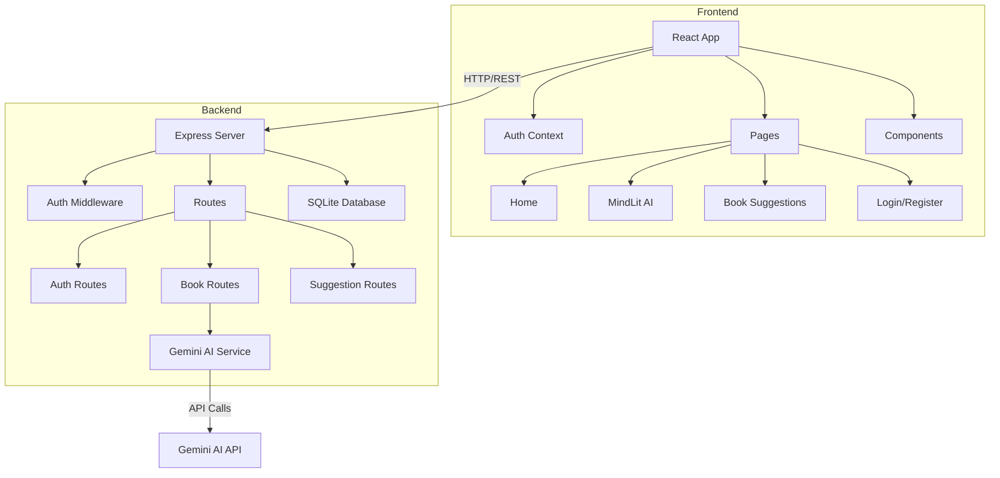

# MindLit System Design Document

## Overview

MindLit is a full-stack web application that provides AI-powered book summaries, lessons, messages, and flashcards. The system uses a modern frontend built with React and Tailwind CSS, communicating with a Node.js/Express backend that integrates with Google's Gemini AI API. User authentication is handled via JWT tokens, and data persistence is managed through SQLite.

### Technology Stack

**Frontend:**
- React with Vite
- Tailwind CSS
- shadcn/ui (modern Tailwind component library)
- React Router for navigation
- Axios for API communication

**Backend:**
- Node.js with Express
- SQLite3 for database
- jsonwebtoken for JWT authentication
- bcrypt for password hashing
- Google Generative AI SDK (@google/generative-ai) for Gemini integration

## Architecture

### High-Level Architecture



### Directory Structure

```
mindlit/
├── frontend/
│   ├── src/
│   │   ├── components/
│   │   │   ├── ui/           # shadcn/ui components
│   │   │   ├── Navbar.jsx
│   │   │   ├── BookInput.jsx
│   │   │   ├── SummaryDisplay.jsx
│   │   │   ├── FlashCard.jsx
│   │   │   └── BookCard.jsx
│   │   ├── pages/
│   │   │   ├── Home.jsx
│   │   │   ├── MindLitAI.jsx
│   │   │   ├── BookSuggestions.jsx
│   │   │   ├── Login.jsx
│   │   │   └── Register.jsx
│   │   ├── context/
│   │   │   └── AuthContext.jsx
│   │   ├── services/
│   │   │   └── api.js
│   │   ├── App.jsx
│   │   └── main.jsx
│   ├── package.json
│   └── tailwind.config.js
│
└── backend/
    ├── src/
    │   ├── config/
    │   │   └── database.js
    │   ├── middleware/
    │   │   └── auth.js
    │   ├── routes/
    │   │   ├── auth.js
    │   │   ├── books.js
    │   │   └── suggestions.js
    │   ├── services/
    │   │   └── gemini.js
    │   ├── models/
    │   │   └── schema.js
    │   └── server.js
    ├── package.json
    └── mindlit.db
```

## Components and Interfaces

### Frontend Components

#### 1. Authentication Components

**Login Component**
- Input fields: email, password
- Submit button triggers API call to `/api/auth/login`
- Stores JWT token in localStorage and AuthContext
- Redirects to Home on success

**Register Component**
- Input fields: username, email, password, confirm password
- Client-side validation for password match
- Submit button triggers API call to `/api/auth/register`
- Auto-login after successful registration

**AuthContext**
- Provides authentication state across the app
- Methods: login(), logout(), checkAuth()
- Stores user info and token
- Wraps App component

#### 2. Navigation Component

**Navbar**
- Three navigation links: Home, MindLit AI, Our Book Suggestions
- Displays user info when authenticated
- Logout button
- Responsive mobile menu
- Active link highlighting using React Router

#### 3. MindLit AI Components

**BookInput Component**
- Two input fields: book name, author name
- Submit button with loading state
- Form validation
- Error message display

**SummaryDisplay Component**
- Sections for: Summary, Messages, Lessons, Flashcards
- Tabbed or accordion interface for organization
- Copy-to-clipboard functionality
- Save/bookmark feature

**FlashCard Component**
- Card flip animation
- Question on front, answer on back
- Navigation buttons (previous/next)
- Progress indicator (e.g., "3 of 10")

#### 4. Book Suggestions Components

**BookCard Component**
- Displays book title, author, description
- "Generate Summary" button
- Thumbnail image (optional)
- Styled with Tailwind and shadcn/ui Card component

### Backend API Endpoints

#### Authentication Routes (`/api/auth`)

```
POST /api/auth/register
Body: { username, email, password }
Response: { token, user: { id, username, email } }

POST /api/auth/login
Body: { email, password }
Response: { token, user: { id, username, email } }

GET /api/auth/me
Headers: { Authorization: Bearer <token> }
Response: { user: { id, username, email } }
```

#### Book Routes (`/api/books`)

```
POST /api/books/generate
Headers: { Authorization: Bearer <token> }
Body: { bookName, authorName }
Response: { 
  id, 
  bookName, 
  authorName, 
  summary, 
  messages: [], 
  lessons: [], 
  flashcards: [{ question, answer }] 
}

GET /api/books/history
Headers: { Authorization: Bearer <token> }
Response: { books: [...] }

GET /api/books/:id
Headers: { Authorization: Bearer <token> }
Response: { book: {...} }
```

#### Suggestions Routes (`/api/suggestions`)

```
GET /api/suggestions
Response: { suggestions: [{ id, title, author, description }] }

POST /api/suggestions
Headers: { Authorization: Bearer <token> }
Body: { title, author, description }
Response: { suggestion: {...} }
```

## Data Models

### Database Schema

```sql
-- Users table
CREATE TABLE users (
  id INTEGER PRIMARY KEY AUTOINCREMENT,
  username TEXT NOT NULL UNIQUE,
  email TEXT NOT NULL UNIQUE,
  password_hash TEXT NOT NULL,
  created_at DATETIME DEFAULT CURRENT_TIMESTAMP
);

-- Books table
CREATE TABLE books (
  id INTEGER PRIMARY KEY AUTOINCREMENT,
  user_id INTEGER NOT NULL,
  book_name TEXT NOT NULL,
  author_name TEXT NOT NULL,
  summary TEXT,
  created_at DATETIME DEFAULT CURRENT_TIMESTAMP,
  FOREIGN KEY (user_id) REFERENCES users(id)
);

-- Messages table
CREATE TABLE messages (
  id INTEGER PRIMARY KEY AUTOINCREMENT,
  book_id INTEGER NOT NULL,
  content TEXT NOT NULL,
  order_index INTEGER,
  FOREIGN KEY (book_id) REFERENCES books(id) ON DELETE CASCADE
);

-- Lessons table
CREATE TABLE lessons (
  id INTEGER PRIMARY KEY AUTOINCREMENT,
  book_id INTEGER NOT NULL,
  content TEXT NOT NULL,
  order_index INTEGER,
  FOREIGN KEY (book_id) REFERENCES books(id) ON DELETE CASCADE
);

-- Flashcards table
CREATE TABLE flashcards (
  id INTEGER PRIMARY KEY AUTOINCREMENT,
  book_id INTEGER NOT NULL,
  question TEXT NOT NULL,
  answer TEXT NOT NULL,
  order_index INTEGER,
  FOREIGN KEY (book_id) REFERENCES books(id) ON DELETE CASCADE
);

-- Book suggestions table
CREATE TABLE suggestions (
  id INTEGER PRIMARY KEY AUTOINCREMENT,
  title TEXT NOT NULL,
  author TEXT NOT NULL,
  description TEXT,
  created_at DATETIME DEFAULT CURRENT_TIMESTAMP
);
```

### Data Flow

1. **User Registration/Login:**
   - Frontend sends credentials → Backend validates → Hash password (bcrypt) → Store in DB → Generate JWT → Return token

2. **Book Summary Generation:**
   - Frontend sends book request → Backend validates JWT → Check if book exists in DB for user → If not, call Gemini AI → Parse AI response → Store in DB → Return structured data

3. **Retrieving Book History:**
   - Frontend requests history → Backend validates JWT → Query DB for user's books → Join with messages, lessons, flashcards → Return aggregated data

## Error Handling

### Frontend Error Handling

- **Network Errors:** Display toast notification with retry option
- **Validation Errors:** Show inline error messages below form fields
- **Authentication Errors:** Redirect to login page, clear stored token
- **API Errors:** Display user-friendly error messages based on status codes

### Backend Error Handling

```javascript
// Centralized error handler middleware
app.use((err, req, res, next) => {
  console.error(err.stack);
  
  if (err.name === 'ValidationError') {
    return res.status(400).json({ error: err.message });
  }
  
  if (err.name === 'UnauthorizedError') {
    return res.status(401).json({ error: 'Invalid token' });
  }
  
  if (err.name === 'GeminiAPIError') {
    return res.status(503).json({ error: 'AI service unavailable' });
  }
  
  res.status(500).json({ error: 'Internal server error' });
});
```

### Gemini AI Service Error Handling

- **Rate Limiting:** Implement exponential backoff
- **API Failures:** Return cached results if available, otherwise user-friendly error
- **Invalid Responses:** Validate AI response structure, retry once if malformed
- **Timeout:** Set 30-second timeout for AI requests

## Testing Strategy

### Frontend Testing

**Unit Tests:**
- Component rendering tests
- Form validation logic
- AuthContext state management
- API service functions

**Integration Tests:**
- User authentication flow
- Book summary generation flow
- Navigation between pages

**Tools:** Vitest, React Testing Library

### Backend Testing

**Unit Tests:**
- Authentication middleware
- JWT token generation/validation
- Password hashing
- Database query functions
- Gemini AI service response parsing

**Integration Tests:**
- API endpoint responses
- Database operations
- End-to-end authentication flow
- Book generation with mocked Gemini API

**Tools:** Jest, Supertest

### Manual Testing Checklist

- [ ] User can register and login
- [ ] JWT token persists across page refreshes
- [ ] Book summary generates correctly with all sections
- [ ] Flashcards display and flip properly
- [ ] Navigation works on all pages
- [ ] Responsive design on mobile/tablet/desktop
- [ ] Error messages display appropriately
- [ ] Book suggestions load and can trigger summary generation

## Security Considerations

1. **Password Security:**
   - Use bcrypt with salt rounds of 10
   - Enforce minimum password length (8 characters)
   - Never log or expose passwords

2. **JWT Security:**
   - Use strong secret key (environment variable)
   - Set reasonable expiration (24 hours)
   - Include user ID in payload
   - Validate on every protected route

3. **API Security:**
   - Store Gemini API key in environment variable
   - Never expose API key to frontend
   - Implement rate limiting on endpoints
   - Validate and sanitize all user inputs

4. **Database Security:**
   - Use parameterized queries to prevent SQL injection
   - Implement proper foreign key constraints
   - Regular backups of SQLite database

5. **CORS Configuration:**
   - Configure CORS to allow only frontend origin
   - Set appropriate headers for security

## Performance Considerations

1. **Caching Strategy:**
   - Cache generated book summaries in database
   - Check database before calling Gemini API
   - Implement client-side caching for book suggestions

2. **Database Optimization:**
   - Index on user_id and book_id columns
   - Use transactions for multi-table inserts
   - Implement pagination for book history

3. **Frontend Optimization:**
   - Lazy load pages with React.lazy()
   - Optimize images and assets
   - Minimize bundle size with code splitting

4. **API Optimization:**
   - Implement request debouncing on frontend
   - Use connection pooling for database
   - Compress API responses with gzip
